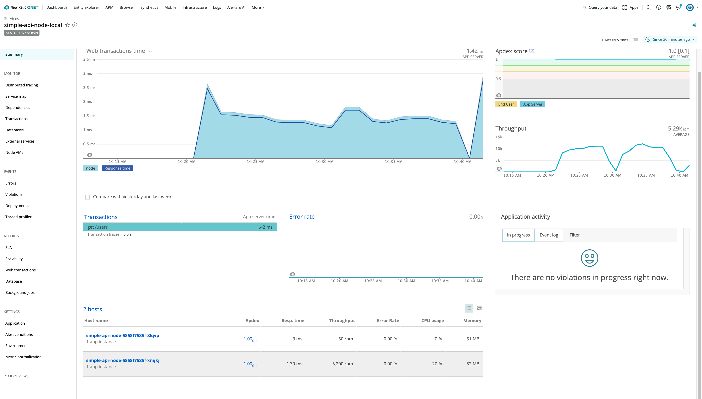
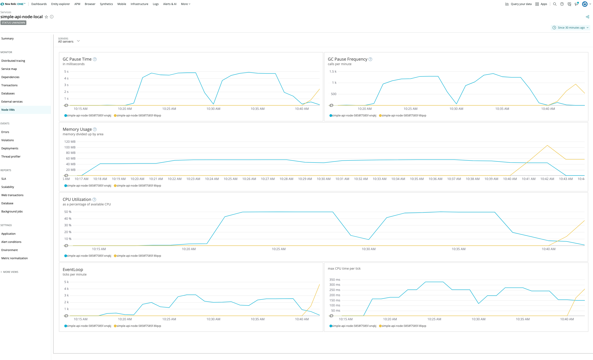

# Simple API to Demonstrate DevOPs and Observability

* Demonstrate how to integrate New Relic with a simple Node.js Express API
* Use K6 to generate a load to populate data in New Relic

## Build and Run Locally

* npm install
* npm start
* CURL Commands
  * curl http://localhost:8080/
  * curl http://localhost:8080/users
  * curl http://localhost:8080/users/bchan

## New Relic Integration

* Sign up for New Relic Free tier: https://one.newrelic.com/
* Reference: https://github.com/newrelic/node-newrelic
* Create **.env** file at the root of the project with New Relic License Key. Sample below:

```
NEW_RELIC_KEY=Your_New_Relic_License_Key_Here
```

## Starting Docker Image

* docker build -t bchan/simple-api-node:latest . --no-cache
* To Start: docker run --name my-simple-node-api -d -p 5000:5000 bchan/simple-api-node
* docker ps -a
* To stop:  docker container stop my-simple-node-api

-----------
## Kubernetes Setup (Minikube on MacOS)

1. minikube start (starting up Minikube Cluster)
2. minikube addons enable ingress  (ingress controller)
3. kubectl apply -f k8s (deploy api stack)
4. Verification
   1. kubectl get pods
   2. kubectl get services
   3. kubectl get ingress
5. minikube service simple-api-node --url (get url)
6. To access host specified in Ingress (http://simple-api-node.info)
   1. minikube ip (obtain IP)
   2. map minikube IP to *simple-api-node.info* in /etc/hosts
   3. curl http://simple-api-node.info/users
7. kubectl delete -f k8s (cleanup)

-----------

## Simple Load Test Using K6

* https://github.com/loadimpact/k6
* brew install k6 (install k6)
* Create load.js file making call to one of the API endpoints
* Kick off a load by running
  * k6 run load.js
  * npm run load-test
* Head back to New Relic to see metrics generated

-----------

## Sample New Relic Dashboard



----------------



------------------
